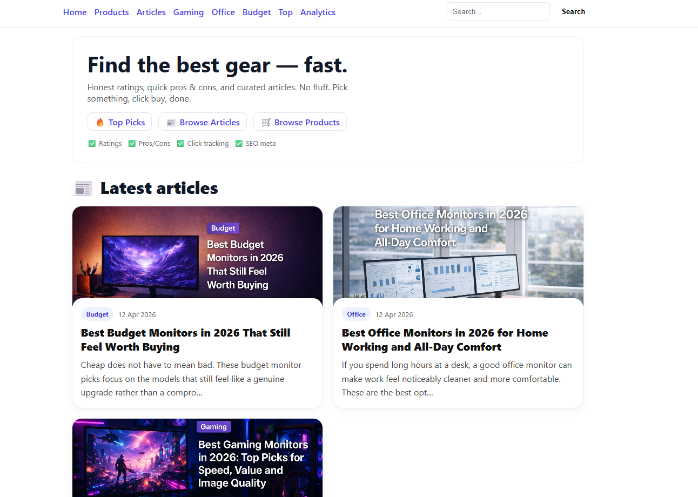
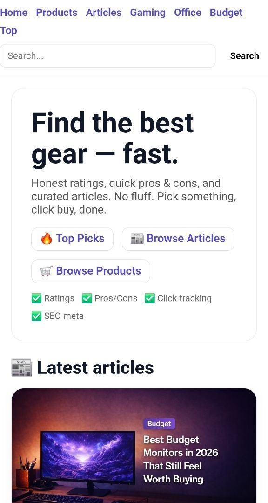
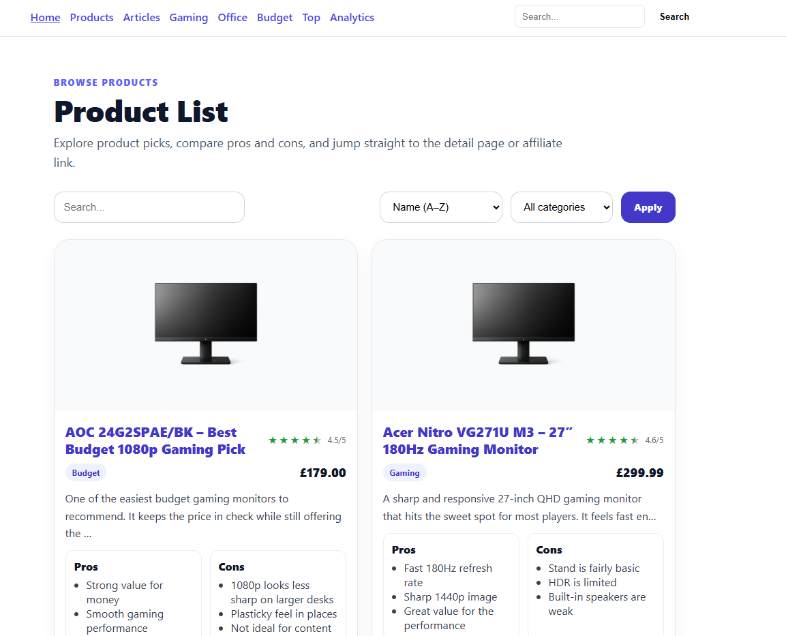

# 🚀 Affiliate Review Site

A niche product review platform built with Django, focused on tech/gadgets.  
Designed to showcase curated product picks, detailed reviews, and track affiliate clicks.

🔗 **Live:** https://matty-dev.com

---

## 📸 Preview

### 🖥️ Homepage (Desktop)
<p align="center">
  <a href="https://matty-dev.com">
    
  </a>
</p>

### 📱 Mobile View
<p align="center">
  
</p>

### 🛒 Product Listing
<p align="center">
  
</p>

---

## ✨ Features

- 📰 Article system (buying guides, top picks, category-based content)
- 🛒 Product catalog with categories (Gaming, Office, Budget, etc.)
- ⭐ Ratings with half-star support
- ✅ Pros & Cons system
- 🔗 Affiliate click tracking & redirect system
- 📊 Click analytics per product
- 🏠 Dynamic homepage:
  - Latest articles
  - Top rated products
  - Most clicked products
- 🔐 Admin analytics panel (staff only)
- 🖼️ Custom media handling (product + article images)
- 📱 Mobile-friendly responsive layout
- ⚙️ Production-ready setup (Gunicorn, static/media config)

---

## 🧱 Tech Stack

- **Backend:** Django 6.x  
- **Language:** Python 3.12  
- **Frontend:** HTML, CSS (custom, no framework)  
- **Database:** SQLite (PostgreSQL ready)  
- **Deployment:** DigitalOcean (Ubuntu + Gunicorn)

---

## 🧠 Key Concepts

- Django class-based views  
- Slug-based routing  
- Template partials (`_stars.html`)  
- Context processors (dynamic navigation)  
- Click tracking system  
- JSON fixtures (`loaddata`)  
- Static & media file handling  
- Responsive UI patterns  

---

## ⚙️ Local Setup

```bash
git clone https://github.com/mattywebdev/affiliate-site.git
cd affiliate-site

python -m venv venv
source venv/bin/activate   # Windows: venv\Scripts\activate

pip install -r requirements.txt

python manage.py migrate
python manage.py createsuperuser
python manage.py runserver

```
## 🔮 Future Improvements

- Amazon API integration  
- User accounts & saved products  
- Product comparison tool  
- Pagination / infinite scroll  
- PostgreSQL migration  
- SEO improvements (structured data, sitemap)  

---

## 👨‍💻 Author

**Mateusz Obstawski**  
🔗 https://github.com/mattywebdev  
🔗 https://www.linkedin.com/in/mateusz-obstawski-9a355ba0/

---

## 💡 Notes

This project is part of my transition into a professional web development career, focusing on real-world, production-ready applications.
